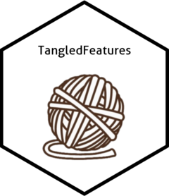

# TangledFeatures  
 
<!-- badges: start -->
[](https://CRAN.R-project.org/package=TangledFeatures)
<!-- badges: end -->

Note: This package is under construction, please use the current version of R and Python here. The website will be updated in the coming days. Please drop me an email at allensunny1242@gmail.com if there are any issues.

TangledFeatures is a feature selection method that extracts needed variables in highly interrelated spaces. It does not alter the nature of the variables and is hence an alternative to traditional dimensionality reduction techniques. 

Features extracted are meant to be inputted into easily explainable models such as linear/logistic regressions or shallow decision trees. TangledFeatures attempts to provide highly accurate and interpretable models as opposed to current black box solutions.

## Installation

You can install the development version of TangledFeatures like so:

``` r
package(TangledFeatures)
install_github("TangledFeatures/TangledFeatures")
```

## Usage
``` r
Result = TangledFeatures(Data, Y_var, Focus_variables = list(), corr_cutoff = 0.7, RF_coverage = 0.95, num_features = 5,  plot = FALSE, fast_calculation = FALSE, cor1 = 'pearson', cor2 = 'PointBiserial', cor3 = 'cramersV')
``` 

## Documentation

This is a basic example which shows you how to solve a common problem:

``` r
library(TangledFeatures)
## basic example code

Result = TangledFeatures(Data, Y_var, Focus_variables = list(), corr_cutoff = 0.7, RF_coverage = 0.95, num_features = 5,  plot = FALSE, fast_calculation = FALSE, cor1 = 'pearson', cor2 = 'PointBiserial', cor3 = 'cramersV')

Variables <- Result$Groups 
```

  
